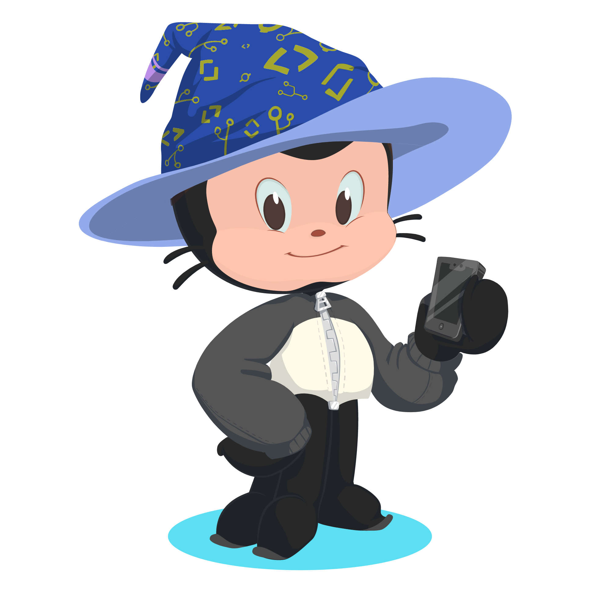

# Hello World!   

 
Oi, meu nome é <strong>Victor de Souza</strong>, eu estou cursando análise e desenvolvimento de sistemas, amo programar👨‍💻, café☕, jogos🎮 e muito mais.

-  Eu estou estudando na FATEC SÃO CAETANO DO SUL - Análise e desenvolvimento de sistemas.
-  Tenho como objetivo atual colocar em prática todo o meu conhecimento, seja em grandes projetos, ou pequenos 🙂

- Todos os projetos grandes ou pequenos irei estar colocando aqui, para que eu possa mostrar minha evolução para as pessoas e para o meu eu do futuro 🙂
   

<b><kbd><kbd>Linguagens e ferramentas:</kbd>  </kbd></b>

  
 &nbsp;
 &nbsp;
 &nbsp;
 &nbsp;
 &nbsp;

 &nbsp;
 &nbsp;
 &nbsp;
 &nbsp;
 &nbsp;
 

<kbd>Social ⤵:</kbd>

   

  

<b><kbd>GitHub Stats</kbd></b>

  
  

<b><kbd>About me</kbd></b>

  
  - [About me](https://victorsouza01.github.io/About-Me/)
 

